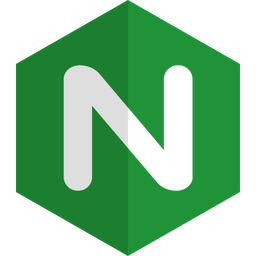

# @EllieValentine

### Glad to see you here! 

I'm Ellie — an Associate Technical Support Engineer working in a large scale operational enterprise environment. Previously worked for a website development company. 💕 I like to read about archeology and neurobiology.

I'm from the USA, living in Bellevue, WA and currently working at <a href="https://github.com/tmobile">T-Mobile </a>.

## Technologies & Tools

<code></code>
<code></code>
<code></code>
<code></code>
<code></code>
<code></code>
<code></code>
<code></code>
<code></code>

## What I'm focusing on 🎯

When I manage to find a free minute, I learn <a href="https://www.docker.com/">Docker</a>, <a href="https://go.dev/">Go</a> and practice in automation and building systems based on microservice architecture.

## Get in touch

- Email: ping@ellievalentine.net
- Linkedin: https://www.linkedin.com/in/ellie-valentine
